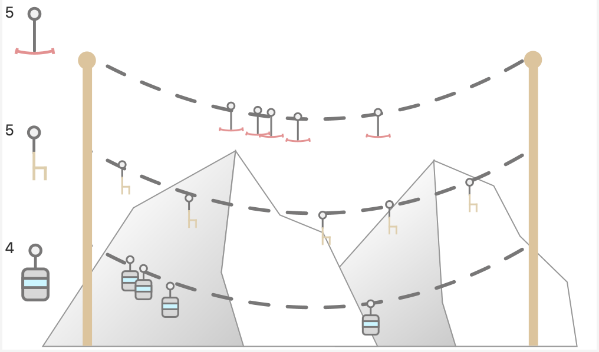

# Lifter 🚡



## Bedienung
Per Drag & Drop der Lifte auf der linken Seite auf die entsprechende "Liftbahn" wird ein neuer Lift erzeugt.  

Durch klicken auf einen Lift in der Liftbahn wird dieser wieder gelöscht. 

Es werden max. 30 Lifte pro Bahn dargestellt, der Counter in der Custom Control wird jedoch auch weiter erhöht.
## How to implement?

1 – Kopiere `Lifter.java` + `style_lifter.css` in dein Projekt kopieren (beide Dateien im gleichen Ordner)

2 – Erstellung der `PresentationModel` Properties für alle Lifte (DragLift, ChairLift, Gondola).

```
    private final IntegerProperty chairLifts   = new SimpleIntegerProperty(5);
    private final IntegerProperty dragLifts    = new SimpleIntegerProperty(5);
    private final IntegerProperty gondolas     = new SimpleIntegerProperty(4);
    
    //Getter / Setter
``` 

3 – Erstelle die `Lifter`-Komponente

```
// declare the custom control
private Lifter cc;

private void initializeControls() {
    ...
    cc = new Lifter();
    ...
}
```

4 – Aufsetzen der Bindings der Properties
```
// all controls
private TextField dragLifts;
private TextField chairLifts;
private TextField gondolas;
    
private void setupBindings() {
    dragLifts.textProperty().bindBidirectional(pm.dragLiftsProperty(), new NumberStringConverter());
    chairLifts.textProperty().bindBidirectional(pm.chairLiftsProperty(), new NumberStringConverter());
    gondolas.textProperty().bindBidirectional(pm.gondolasProperty(), new NumberStringConverter());

    cc.gondolasProperty().bindBidirectional(pm.gondolasProperty());
    cc.dragLiftsProperty().bindBidirectional(pm.dragLiftsProperty());
    cc.chairLiftsProperty().bindBidirectional(pm.chairLiftsProperty());
}
```

5 – Hinzufügen zum UI (an die entsprechend passende Stelle). Beispiel:

```
private void layoutControls() {
        ..
        setCenter(cc);
    }
```

6 – Try out ⛄️